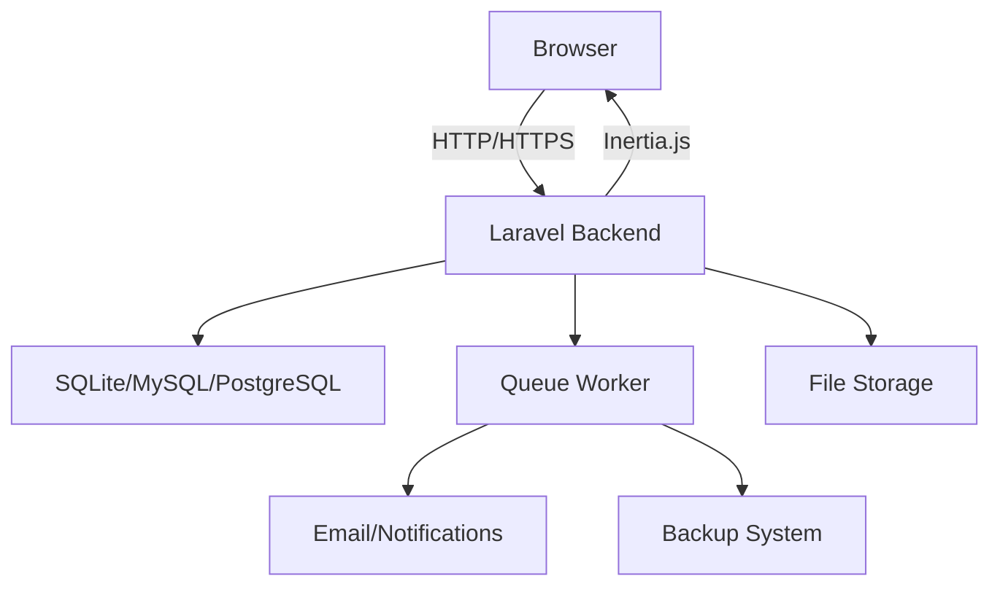

## What is Nguhöe EHR?

Nguhöe EHR is a complete Electronic Health Record (EHR) system built specifically for small clinics and healthcare practices. It provides a modern, intuitive interface for managing patients, appointments, consultations, prescriptions, and payments—all in one integrated platform.

<Note>
Nguhöe (pronounced "ngu-hoe-eh") means "health" in several indigenous languages, reflecting our commitment to accessible healthcare management.
</Note>

## Who is it for?

Nguhöe EHR is designed for:

- **Small clinics** looking for an affordable, self-hosted EHR solution
- **Independent practitioners** who need comprehensive patient management
- **Medical practices** wanting to digitize their patient records and workflows
- **Healthcare startups** building on a modern, extensible platform

The system supports multiple user roles including administrators, doctors, receptionists, and patients, making it suitable for both solo practitioners and multi-provider clinics.

## Key features

### Patient management

Maintain comprehensive patient records with demographics, medical history, allergies, chronic diseases, and current medications. Each patient record includes:

- Personal identification and contact information
- Complete medical antecedents
- Allergy tracking
- Chronic disease management
- Current medication lists
- File attachments for lab results and imaging

### Appointment scheduling

Efficient appointment management with:

- Calendar-based scheduling
- Multiple appointment statuses (scheduled, confirmed, completed, cancelled, no-show)
- Doctor availability management
- Patient self-booking portal
- Appointment reminders and notifications

### Clinical consultations

Document patient visits with structured consultation records:

- Vital signs tracking (weight, height, temperature, blood pressure, heart rate, respiratory rate, oxygen saturation)
- Reason for visit documentation
- Clinical findings and examination notes
- Diagnosis recording
- Treatment plan management
- Link consultations to appointments

### Prescription management

Create and manage prescriptions with:

- Multiple medication support per prescription
- Dosage and frequency specifications
- Duration tracking
- General instructions
- PDF generation for printing
- Patient access to prescription history

### Payment tracking

Simplify billing and payment management:

- Multiple payment methods (cash, card, transfer)
- Link payments to consultations
- Payment status tracking
- Reporting and analytics

### Role-based access control

Secure multi-user system with four distinct roles:

- **Admin**: Full system access including staff management and reports
- **Doctor**: Patient management, consultations, and prescriptions
- **Receptionist**: Appointment scheduling and payment processing
- **Patient**: Personal portal for appointments and prescriptions

## System architecture

Nguhöe EHR is built as a modern monolithic web application with a reactive frontend:

### Backend architecture

The backend follows Laravel's MVC architecture:

- **Routes**: Organized by role-based middleware groups in `routes/web.php`
- **Controllers**: Handle business logic and return Inertia responses
- **Models**: Eloquent ORM models with relationships
- **Migrations**: Database schema versioning
- **Policies**: Authorization rules using Laravel's policy system
- **Jobs**: Background tasks for emails, notifications, and backups

### Frontend architecture

The frontend is a single-page application (SPA) using:

- **React 19**: Component-based UI with modern hooks
- **Inertia.js v2**: Seamless server-side routing without API endpoints
- **Tailwind CSS v4**: Utility-first styling with custom design system
- **Radix UI**: Accessible component primitives
- **TypeScript**: Type-safe frontend code

### Data flow

1. User interacts with React components
2. Inertia.js sends requests to Laravel routes
3. Controllers process business logic
4. Data is returned as Inertia responses
5. React components automatically re-render

<Info>
Inertia.js eliminates the need for a separate API layer while maintaining the benefits of a modern SPA.
</Info>

## Tech stack

Nguhöe EHR is built with modern, production-ready technologies:

### Backend

- **Laravel 12**: Latest version of the PHP framework
- **PHP 8.2+**: Modern PHP with type declarations and enums
- **Spatie Laravel Permission**: Role and permission management
- **Laravel Fortify**: Headless authentication backend
- **Spatie Laravel Backup**: Automated backup system
- **DomPDF**: PDF generation for prescriptions and reports
- **Intervention Image**: Image processing for attachments

### Frontend

- **React 19**: Latest React with concurrent features
- **Inertia.js v2**: Modern SPA without API complexity
- **TypeScript**: Type-safe JavaScript
- **Tailwind CSS v4**: Latest version with native CSS layer
- **Radix UI**: Accessible component primitives
- **Lucide React**: Icon library
- **Recharts**: Data visualization

### Development tools

- **Vite**: Fast build tool and dev server
- **Pest**: Modern PHP testing framework
- **Laravel Pint**: Opinionated code formatter
- **ESLint**: JavaScript linting
- **Prettier**: Code formatting
- **Laravel Pail**: Real-time log viewing

### Database options

- **SQLite**: Default for development and small deployments
- **MySQL/MariaDB**: Production-ready relational database
- **PostgreSQL**: Advanced features and performance

## Getting started

Ready to start using Nguhöe EHR?

<CardGroup cols={2}>
  <Card title="Quick start" icon="rocket" href="/quickstart">
    Get up and running in minutes with our quick start guide
  </Card>
  <Card title="Installation" icon="server" href="/installation">
    Detailed installation instructions for production deployments
  </Card>
</CardGroup>

## Next steps

After installation, explore these areas:

- **Configuration**: Customize the system for your clinic
- **User management**: Set up staff accounts and roles
- **Patient import**: Migrate existing patient data
- **Backup setup**: Configure automated backups
- **Security**: Enable HTTPS and secure your deployment